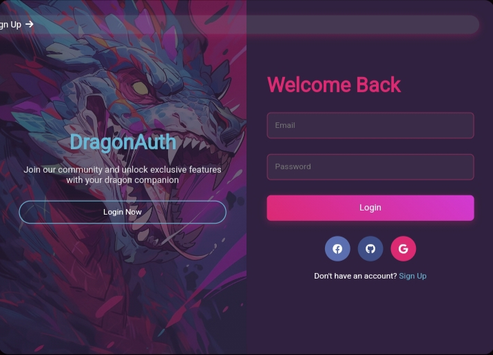

# 🐉 DragonAuth - Where Dragons Guard Your Passwords

  
*(Replace with your actual screenshot - show off those dragon vibes!)*

**Tired of boring login screens?** Let our anime dragon be your digital bouncer! DragonAuth combines mythical security with modern design, because even dragons need a side hustle in the 21st century.

## 🔥 Features That Breathe Fire

- **Dragon-powered authentication** (well, almost... we're working on the fire-breathing API)
- **Smooth form transitions** - smoother than a dragon's scales
- **Social login options** - because even dragons have Facebook accounts
- **Responsive design** - works on knight's armor, peasant's scrolls, and your iPhone
- **Cyberpunk color scheme** - stolen from a dragon's secret treasure hoard
- **Animated everything** - if it doesn't move, is it even web design?

## 🚀 Installation (No Magic Spell Required)

1. Clone this repo (careful, dragon inside!):
   ```bash
   git clone https://github.com/yourusername/dragon-auth.git
   ```
2. Open `index.html` in your browser
3. Watch the dragon yawn at your existing login screens

**Pro Tip:** Offer virtual treats to the dragon for better performance 🍗

## 🛠 Tech Stack (Dragon-Approved)

- **HTML5** - For dragon-approved structure
- **CSS3** - Magic spells for styling
- **JavaScript** - Making dragons dance
- **Font Awesome** - Fancy social icons
- **1 Genuine Anime Dragon** - Chief Security Officer

## 🎨 Color Palette (Stolen from Dragon's Hoard)

| Color Code       | Usage                |
|------------------|----------------------|
| `#2F213F`        | Dark mystic purple   |
| `#DB2972`        | Dragon blush pink    |
| `#67B8D5`        | Ice dragon breath    |
| `#7E2C58`        | Enchanted wine       |
| `#D13AD3`        | Magic mushroom glow  |

## 🤝 Contributing (Dragon Tamers Welcome)

Found a bug? The dragon probably ate it.  
1. Fork the repository
2. Create your feature branch (`git checkout -b feature/AmazingFeature`)
3. Commit your changes (`git commit -m 'Add some AmazingFeature'`)
4. Push to the branch (`git push origin feature/AmazingFeature`)
5. Open a Pull Request

**Warning:** Dragon may demand tribute in form of code reviews 🐲

## 📜 License (Dragon Law)

Distributed under the MIT License.
